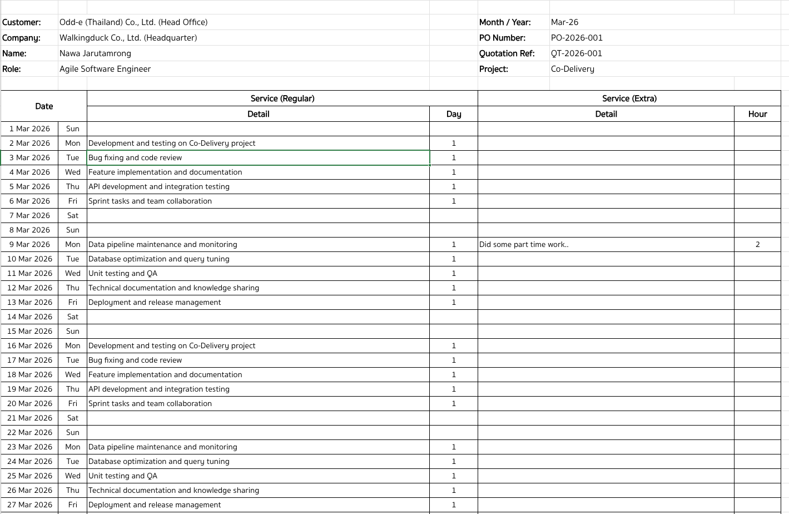

# Timesheet Auto-Filler

Auto-fill your monthly timesheet `.xlsx` with work descriptions using a
predefined list or AI-generated content.

## Prerequisites

- Python 3.9+
- A timesheet Excel template (`.xlsx`)

## Installation

1. Clone the repository:

   ```bash
   git clone https://github.com/your-repo/timesheet-filler.git
   cd timesheet-filler
   ```

2. Create a virtual environment (optional but recommended):

   ```bash
   python -m venv venv
   source venv/bin/activate  # macOS/Linux
   venv\Scripts\activate     # Windows
   ```

3. Install dependencies:

   ```bash
   pip install -r requirements.txt
   ```

## Configuration

Edit `config.yaml` to match your details:

```yaml
template_file: timesheet_template.xlsx
output_file: timesheet_filled.xlsx

company: "Your Company Name"
name: "Your Name"
role: "Your Role"
project: "Your Project"
year: 2026
month: 3

mode: list  # "list" or "ai"

anthropic_api_key: "your-api-key-here"  # required only for "ai" mode

works:
  - "Development and testing"
  - "Bug fixing and code review"
  - "Feature implementation"

notes: |
  - Week 1: Some context
  - Week 2: More context
```

### Modes

| Mode   | Description                                              | API Key Required |
| ------ | -------------------------------------------------------- | ---------------- |
| `list` | Cycles through `works` items in order for each workday   | No               |
| `ai`   | Uses Claude API to generate varied, realistic descriptions | Yes              |

### Getting an Anthropic API Key (for AI mode)

1. Go to [console.anthropic.com](https://console.anthropic.com/)
2. Create an account and generate an API key
3. Paste it in `config.yaml` under `anthropic_api_key`

## Usage

```bash
python fill_timesheet.py
```

### Example Output



### Cell References

If your template has a different layout, update these constants at the top
of `fill_timesheet.py`:

```python
CELL_COMPANY = "B4"
CELL_NAME = "B5"
CELL_ROLE = "B6"
CELL_MONTH_YEAR = "I3"
DATE_START_ROW = 10
COL_DATE = "A"
COL_DAY = "B"
COL_DETAIL = "C"
COL_DAY_COUNT = "G"
```

## Notes

- **Windows users:** Replace `%-d` with `%#d` in the `strftime` call
  inside `fill_timesheet.py`.
- Weekends (Sat/Sun) are automatically skipped.
- In `list` mode, if workdays exceed the number of `works` items,
  the list cycles from the beginning.
- Review the generated `.xlsx` before submitting.

